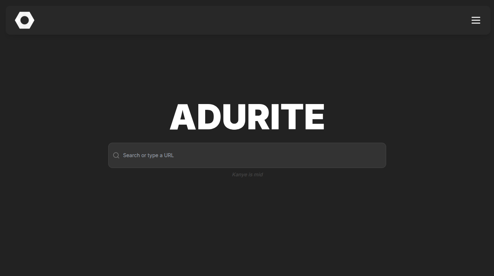

<h1 align="center"></img></h1>
<p align="center">Adurite is an unblocked games website with over 300 games, 50 apps, a fast, reliable proxy with emulator support, and more.</p>
<p align="center"></img></p>

## Features
* about:blank
* Proxy
* 300+ games
* 50+ apps
* Custom cloaks
* Wisp + Epoxy technology

### Proxy Support
* easyfun.gg
* Google
* Youtube
* Discord
* TikTok
* Crazygames
* Cool Math Games
* And more!

## Releases
To get releases for easy local deployment, go to the releases tab. Each release will be formatted as `major.minor.patch`. So, if it was major version 4, minor version 2, and patch 7, the tag would be `v4.2.7`.

## Deployment

There are two different options when deploying Adurite on your own. Please read through them below. For more info on deployment options and more possible services, see [More Deployment](deployment.md)

### Option 1: Vercel
Vercel is a plausible option for Astro sites, and works perfectly with our website. Follow the steps to get started.

#### Using the button
Simple, just click the button. <br><br>
[](https://vercel.com/new/clone?repository-url=https%3A%2F%2Fgithub.com%2Fadurite-network%2FAdurite&project-name=adurite&repository-name=Adurite&demo-title=Adurite&demo-description=A%20Vercel-deployed%20Adurite%20website.&demo-url=https%3A%2F%2Fuseadurite.vercel.app%2F&demo-image=https%3A%2F%2Favatars.githubusercontent.com%2Fu%2F185982685%3Fs%3D200%26v%3D4)

<hr>

#### Manually cloning
Go to Vercel, hit New Project, then enter this repository's URL into the 3rd Party URL slot. Then, follow the steps to deploy.

### Option 2: Github Codespaces / Local Deployment
#### 1. Clone the Repository

First, clone the **Adurite** repository to your server:

```bash
git clone https://github.com/adurite-network/Adurite
cd Adurite
```

#### 2. Install Dependencies and Start the Project

Once you've cloned the repository, install the required dependencies and start the application:

```bash
pnpm install && pnpm start
```

This will install all the necessary dependencies and start the application in production mode.

## Development

If you are developing for Adurite, use the following commands:

```bash
pnpm install && pnpm dev
```

This will install dependencies and start the development server, which will automatically reload when you make changes to the code.

#### Enabling the Astro toolbar

To enable the Astro development toolbar, run the following command to enable and start the server.

```bash
astro preferences enable --global devToolbar && astro dev
```

<hr>

###### This website is based on <a href="https://github.com/UseInterstellar/Interstellar-Astro">Interstellar.</a>

###### Lots of thanks to <a href="https://github.com/titaniumnetwork-dev/">Titanium Network</a> (for Ultraviolet), Corn Unblocked for a list of free Wisp servers, and Mercury Workshop for Epoxy, Bare, and Wisp-JS
